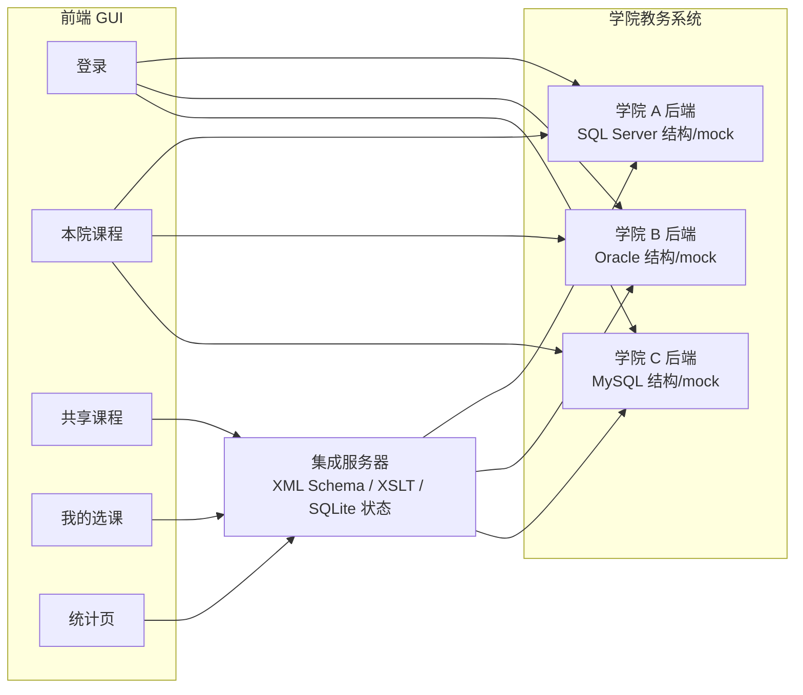
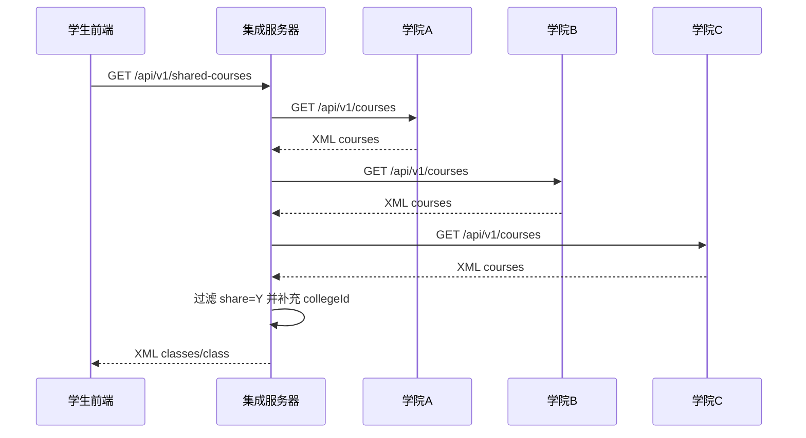
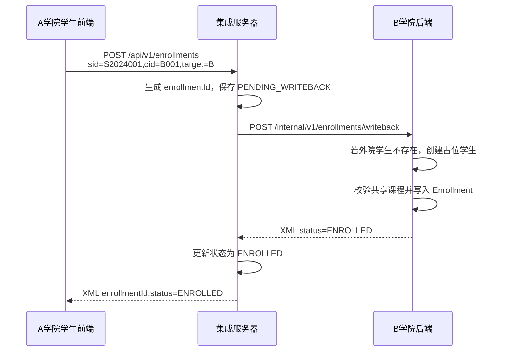
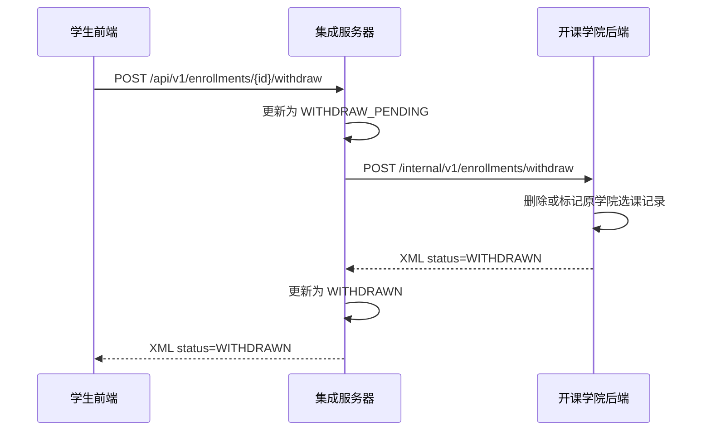
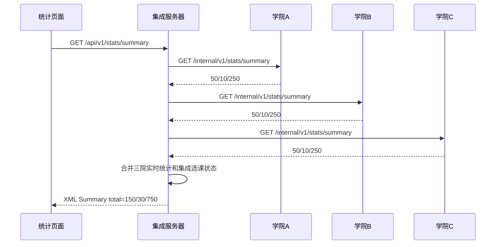

# 作业 3：基于 XML 数据集成的集成教务系统

## 1. 项目概述

本系统面向学院 A、B、C 三个已有教务系统的课程共享场景。三个学院分别基于 SQL Server、Oracle、MySQL 的异构数据库结构建模，内部学生、课程、选课表字段名称、类型和含义存在差异。系统新增集成服务器，通过统一 XML Schema 和字段映射完成共享课程查询、跨院选课写回、退选写回和汇总统计。

默认交付方式采用本机 mock 数据演示，避免验收时依赖 SQL Server、Oracle、MySQL 服务；同时提供三套真实 DBMS 的 SQL 数据导入脚本，体现异构数据库的数据输入工作。

## 2. 小组分工

| 成员 | 负责内容 |
| --- | --- |
| zmt | 学院 A 后端 |
| 李栋 | 学院 B 后端 |
| 陈文新 | 学院 C 后端 |
| 邵勃源 | 集成服务器 |
| 王雨欣 | 前端 |
| 叶原原 | 文档 |
| 本人 | 联调部署、最终交付闭环 |

## 3. 需求对应关系

| 作业要求 | 系统实现 |
| --- | --- |
| A/B/C 教学管理系统使用不同 DBMS | A 按 SQL Server 表结构，B 按 Oracle 表结构，C 按 MySQL 表结构实现仓储适配 |
| 每院 50 个学生、10 门课程、每个学生 5 门课 | `demo_data.py` 统一生成，每院 50/10/250，服务启动自动加载 |
| 三院学生互不覆盖，课程信息有重叠 | 学号前缀区分学院；课程名称使用同一批模板，课程编号归属不同学院 |
| 基于 XML 技术实现课程共享 | 学院后端、集成服务器和前端联调接口均使用 XML 请求/响应 |
| 跨院选课后写回原课程所在学院 | 集成服务器同步调用目标学院 `/internal/v1/enrollments/writeback` |
| 统计所有学院学生、课程、选课信息 | 集成服务器调用三院 `/internal/v1/stats/summary` 后汇总 |
| 实现退选流程 | 集成服务器调用目标学院 `/internal/v1/enrollments/withdraw` 并更新状态 |
| A/B/C 系统需要 GUI 和登录 | React 前端提供三院登录、本院课程、共享课程、我的选课和统计页面 |
| 报告给出数据集成流程图 | 本报告第 9 节给出 Mermaid 流程图 |

## 4. 数据输入设计

### 4.1 演示数据规模

每个学院启动后都具有固定、可复现的数据：

| 学院 | 学生数 | 课程数 | 本院选课数 | 可用账号 |
| --- | ---: | ---: | ---: | --- |
| A | 50 | 10 | 250 | `a_student1 / 123456` |
| B | 50 | 10 | 250 | `b_student1 / 123456` |
| C | 50 | 10 | 250 | `c_student1 / 123456` |

生成规则：

- 学院 A 学号为 `S2024001` 到 `S2024050`。
- 学院 B 学号为 `B2024001` 到 `B2024050`。
- 学院 C 学号为 `C2024001` 到 `C2024050`。
- 每院课程为 `{学院编号}001` 到 `{学院编号}010`。
- 每名学生按确定性轮转规则选择 5 门本院课程，因此每院产生 `50 * 5 = 250` 条本院选课记录。
- 每院第 1、3、5、6、7 门课标记为共享课程。

### 4.2 一键生成与启动

本机演示启动命令：

```bash
./scripts/install_demo_deps.sh
./scripts/dev_up.sh
```

`dev_up.sh` 会完成：

- 停止旧演示进程。
- 清空集成服务器 SQLite 演示库。
- 运行 `scripts/generate_demo_sql.py` 生成真实库导入 SQL。
- 启动 A/B/C 后端、集成服务器和前端。
- 三院 mock 仓储在服务启动时自动加载 50/10/250 数据。

真实库导入 SQL 输出位置：

| 学院 | DBMS | SQL 文件 |
| --- | --- | --- |
| A | SQL Server | `data/generated/college_a_demo.sql` |
| B | Oracle | `data/generated/college_b_demo.sql` |
| C | MySQL | `data/generated/college_c_demo.sql` |

## 5. 三院异构数据库结构

### 5.1 学院 A：SQL Server

| 表 | 字段摘要 | 说明 |
| --- | --- | --- |
| Account | 账户名、密码、权限 | 登录账号 |
| Student | 学号、姓名、性别、院系、关联账户 | 学生信息 |
| Course | 课程编号、课程名称、学分、授课老师、授课地点、共享 | 课程信息 |
| Enrollment | 课程编号、学生编号、成绩 | 本院选课 |
| EnrollmentLog | enrollment_id、student_id、course_id、origin、status | 统一写回日志 |

### 5.2 学院 B：Oracle

| 表 | 字段摘要 | 说明 |
| --- | --- | --- |
| Account | 账户名、密码、级别、客体 | 登录账号和权限 |
| Student | 学号、姓名、性别、专业、密码 | 学生信息 |
| Course | 编号、名称、课时、学分、老师、地点、共享 | 课程信息 |
| Enrollment | 课程编号、学号、得分 | 本院选课 |
| EnrollmentLog | enrollment_id、student_id、course_id、origin、status | 统一写回日志 |

### 5.3 学院 C：MySQL

| 表 | 字段摘要 | 说明 |
| --- | --- | --- |
| Account | acc、passwd、CreateDate | 登录账号 |
| Student | Sno、Snm、Sex、Sde、Pwd | 学生信息 |
| Course | Cno、Cnm、Ctm、Cpt、Tec、Pla、Share | 课程信息 |
| Enrollment | Cno、Sno、Grd | 本院选课 |
| EnrollmentLog | enrollment_id、student_id、course_id、origin、status | 统一写回日志 |

## 6. XML 数据集成设计

### 6.1 统一课程 XML

共享课程统一为 `classes/class`：

```xml
<classes>
  <class>
    <id>B001</id>
    <name>数据库系统</name>
    <time>32</time>
    <score>3</score>
    <teacher>B师01</teacher>
    <location>B-101</location>
    <collegeId>B</collegeId>
  </class>
</classes>
```

`collegeId` 是扩展字段，用于标识课程开课学院，前端据此确定跨院选课目标。

### 6.2 统一选课 XML

选课统一为 `choices/choice`：

```xml
<choices>
  <choice>
    <sid>S2024001</sid>
    <cid>B001</cid>
    <score>0</score>
  </choice>
</choices>
```

集成服务器外层增加 `homeCollegeId`、`targetCollegeId`、`requestTime` 等元数据，实现路由和追踪。

### 6.3 字段映射

| 统一字段 | A 来源 | B 来源 | C 来源 |
| --- | --- | --- | --- |
| 学生 id | Student.学号 | Student.学号 | Student.Sno |
| 学生 name | Student.姓名 | Student.姓名 | Student.Snm |
| 学生 major | Student.院系 | Student.专业 | Student.Sde |
| 课程 id | Course.课程编号 | Course.编号 | Course.Cno |
| 课程 name | Course.课程名称 | Course.名称 | Course.Cnm |
| 课程 time | 导出层补 0 或生成值 | Course.课时 | Course.Ctm |
| 课程 score | Course.学分 | Course.学分 | Course.Cpt |
| 课程 teacher | Course.授课老师 | Course.老师 | Course.Tec |
| 选课 sid | Enrollment.学生编号 | Enrollment.学号 | Enrollment.Sno |
| 选课 cid | Enrollment.课程编号 | Enrollment.课程编号 | Enrollment.Cno |
| 选课 score | Enrollment.成绩 | Enrollment.得分 | Enrollment.Grd |

## 7. 系统架构



## 8. 核心接口

| 服务 | 接口 | 说明 |
| --- | --- | --- |
| 学院端 | `POST /api/v1/auth/login` | 学生登录 |
| 学院端 | `GET /api/v1/courses` | 查询本院课程 |
| 学院端 | `GET /internal/v1/stats/summary` | 返回本院学生、课程、选课统计 |
| 学院端 | `POST /internal/v1/enrollments/writeback` | 接收跨院选课写回 |
| 学院端 | `POST /internal/v1/enrollments/withdraw` | 接收退选写回 |
| 集成端 | `GET /api/v1/shared-courses` | 汇总共享课程 |
| 集成端 | `POST /api/v1/enrollments` | 提交跨院选课 |
| 集成端 | `GET /api/v1/students/{sid}/enrollments` | 查询我的跨院选课 |
| 集成端 | `POST /api/v1/enrollments/{id}/withdraw` | 发起退选 |
| 集成端 | `GET /api/v1/stats/summary` | 汇总三院统计 |

## 9. 数据集成流程图

### 9.1 共享课程查询



### 9.2 跨院选课与写回



### 9.3 退选流程



### 9.4 统计汇总流程



## 10. 测试与验收

### 10.1 自动化测试

已验证的命令：

```bash
python scripts/generate_demo_sql.py
python -m pytest -s -q college_a/tests/test_app.py college_b/tests/test_app.py college_c/tests/test_app.py integration_server/tests/test_integration_server.py
cd frontend && npm run build
./scripts/dev_up.sh
./scripts/smoke_test.sh
```

后端测试覆盖：

- 登录成功。
- 本院课程统一 XML 字段。
- 每院课程数 10。
- 学院内部统计接口返回 50/10/250。
- 跨院选课写回支持外院学生占位。
- 集成服务器共享课程包含 `collegeId`。
- 学生选课列表不返回已退选记录。
- 集成服务器统计优先聚合三院实时统计。

### 10.2 Smoke Test 验收点

`scripts/smoke_test.sh` 自动验证：

- A/B/C/集成服务器健康检查。
- 三院课程数均为 10。
- 三院内部统计均为学生 50、课程 10、选课 250。
- 集成服务器共享课程包含 B 学院课程。
- A 学生选择 B001 后写回成功，状态为 `ENROLLED`。
- 我的选课能查询到该记录。
- 退选后我的选课不再返回该记录。
- 集成服务器总统计为学生 150、课程 30、选课 750。

### 10.3 手工演示步骤

1. 执行 `./scripts/dev_up.sh`。
2. 打开 `http://localhost:5173/college/A/login`。
3. 使用 `a_student1 / 123456` 登录。
4. 查看本院课程。
5. 进入共享课程，选择 B 或 C 学院共享课。
6. 进入“我的选课”，确认跨院选课记录。
7. 点击退选，确认记录移除。
8. 打开 `http://localhost:5173/integration` 查看统计页。
9. 执行 `./scripts/dev_down.sh` 停止服务。

## 11. 结论

本系统完成了作业要求的 XML 数据集成示例：三院保留异构数据结构，集成服务器以统一 XML Schema 汇聚共享课程，并在跨院选课和退选时将结果写回原课程所在学院。演示数据可一键重置，真实数据库导入 SQL 可复现生成，前端 GUI 能完整演示登录、查课、选课、退选和统计闭环。
